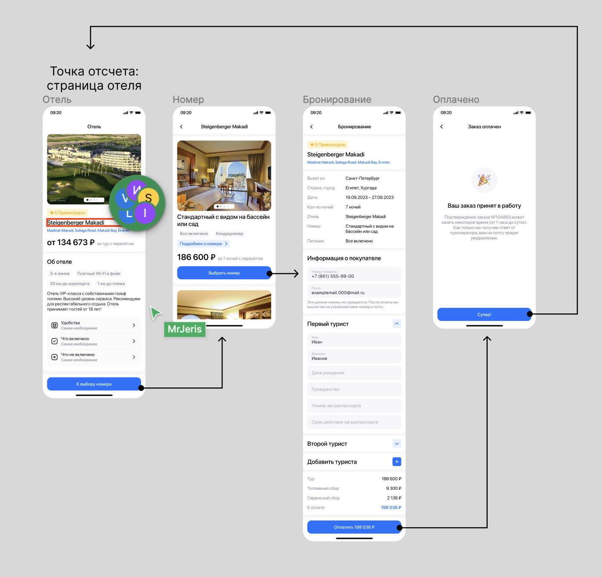

# Тестовое задание, приложение Отеля


Тестовое приложение от компании EFFECTIVE MOBILE

<div style="display: flex; flex-direction: row; flex-wrap: wrap; justify-content: center; column-gap: 24px; row-gap: 20px;">
  <span></span>
  <span></span>
  <span></span>
  <span></span>
  <span></span>
  <span></span>
  <span></span>
  <span></span>
</div>

## Структура проекта
Все модули расположены просто по файлам для простоты
```
TestTaskHotel
├── TestTaskHotelApp
│   
├── View
│   
├── Model
│   
├── ViewModel
│   
├── Data 
│
└── Utilities                  
```

## Технологии и инструменты

- [SwiftUI](https://developer.apple.com/xcode/swiftui/)
- [Repository Pattern]()
